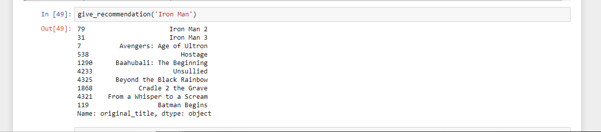

# movie_recommendation_system
Movie Recommendation system in python

Movie recommendation system based on content based reommendation system. Used tmdb's dataset(csv file).

Instruction: run the ipynb file and input your movie in give_recommendation function and get suitable recommendation!

Result: 

Future Work: 
TO develop API of this system. And to deploy it in server.
